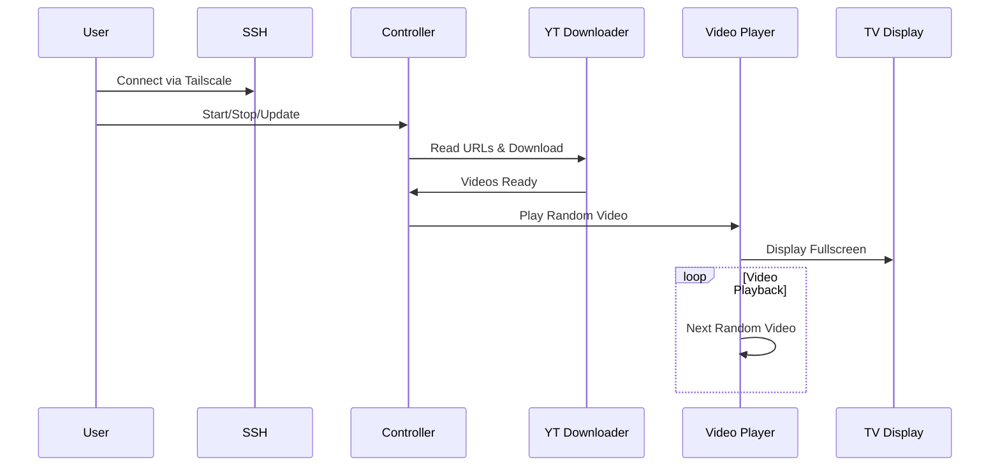

# SlowTV+ 📺

```ascii
   _____  __                 _______ __      __    __ 
  / ___/ / / ___  _      __ /_  __// /     / /   / /_
  \__ \ / / / _ \| | /| / /  / /  / /_____/ /_  / __/
 ___/ // / /  __/| |/ |/ /  / /  / /_____/ / /_/ /_  
/____//_/  \___/ |__/|__/  /_/  /_/     /_/\__/\__/  
```

A Raspberry Pi-based video player designed for creating a calming, slow TV experience for toddlers. Inspired by the Norwegian slow TV movement and Toniebox concept.

## Features

- Full-screen video playback from curated YouTube sources
- Random playlist generation from your selected content
- Easy installation and updates via simple shell commands
- Future support for RFID-based content selection
- Headless operation with Tailscale remote access
- Safe content management through external URL list

## System Architecture



## Installation

1. Clone the repository:
```bash
git clone https://github.com/texuf/slow-tv-plus.git
cd slow-tv-plus
```

2. Create your video URL list:
```bash
cp urls.example.txt urls.txt
nano urls.txt  # Add your YouTube URLs
```

3. Install dependencies:
```bash
./install.sh
```

## Usage

Start the player:
```bash
./slowtv.sh start
```

Stop the player:
```bash
./slowtv.sh stop
```

Update to latest version:
```bash
./slowtv.sh update
```

## Configuration

Create a `urls.txt` file with one YouTube URL per line:
```
https://www.youtube.com/watch?v=example1
https://www.youtube.com/watch?v=example2
```

## Future Features

- RFID/NFC tag support for physical content selection
- Web-based control interface
- Parental controls and screen time limits
- Custom video transitions
- Schedule-based playback

## Contributing

Contributions are welcome! Please feel free to submit a Pull Request.

## License

MIT License - See LICENSE file for details